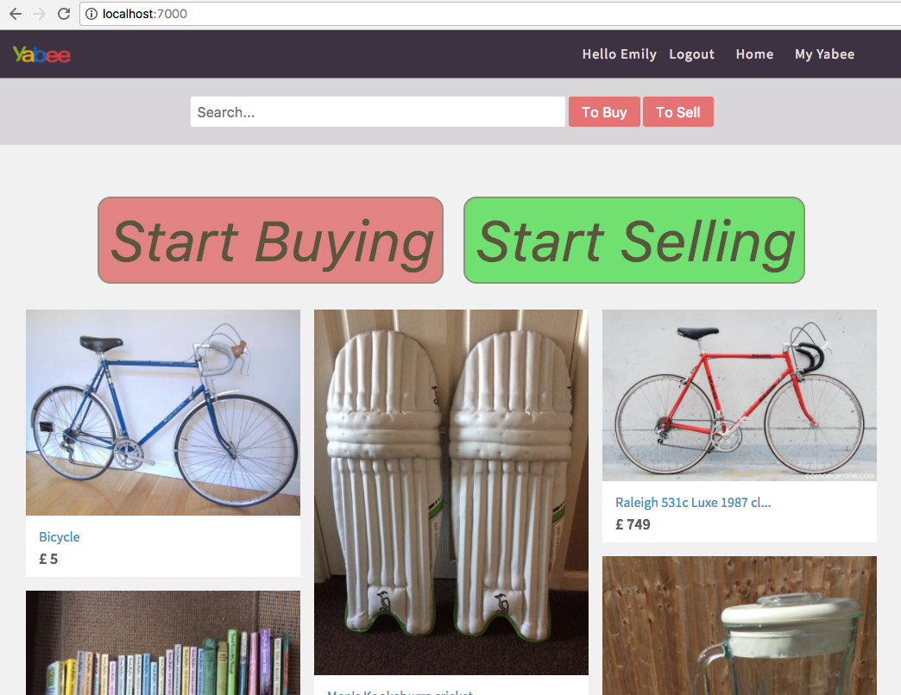
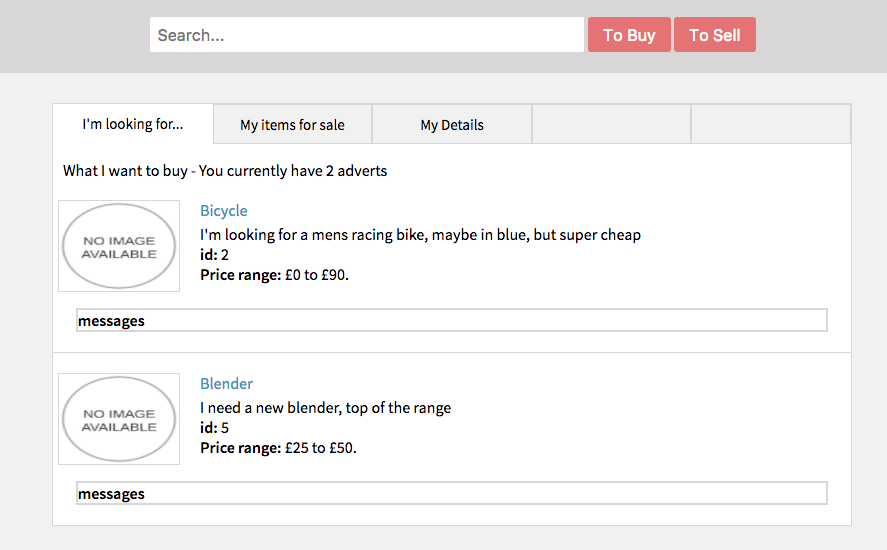
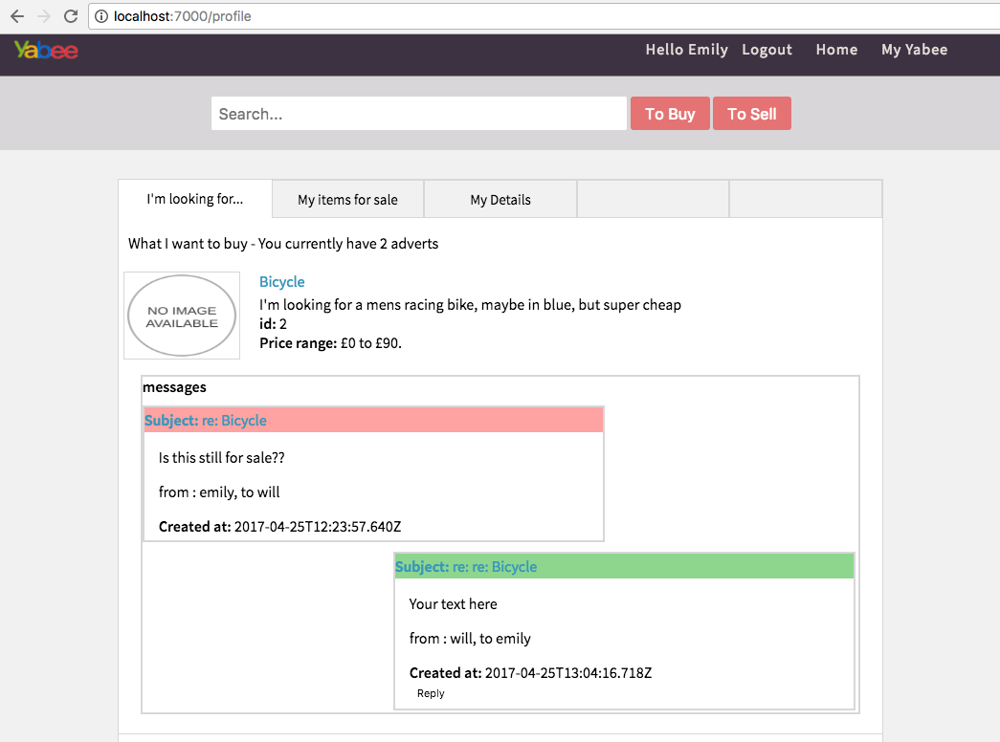

# Yabee

### GA WDI London - Project 4

***Yabee*** is a second hand trading application, built with Ruby on Rails. The concept is simple - a user can post an advert about an item they would like to buy, post an offer about an item they are selling, and write messages between eachother when one persons advert matches anothers offer. 

#### Approach / How it works

This app has four main models - User, Advert, Offer and Message. An un-registered user can search the site for things for sale, and things people want to buy. By loggin in a user can create adverts for what they are selling/buying. If an advert mathces an offer then there is an option to send a direct message to that user. On the users profile page there are tabs to view all their current adverts and offers, and each of those has its own section for messages.

#### The build

* HTML 5, SCSS and Angular are used in the frontend
* Ruby on Rails is used to serve JSON to the app. 
* The desktop version was styled to be as close to Gumtree as possible.
* The mobile view was an extension on this theme.
* AWS was used for file storage (images of things for sale).
* User authentication/session uses bcrypt and jwt.

#### Problems & Challenges

Initially I wanted it to be more focused on people who want to buy things, but I struggled to make this an engaging app so I included much more emphasis on selling than I originally intended.

Working on a messanger system was a good challenge, although the version I have working now is missing a few features:

1. it is only possible to send a message between users who each have a matching advert/offer
2. There is no notification for recieving a new message.

However by including the message feature it became a better learning experieince and it will be good to try and work on this in the future. 
